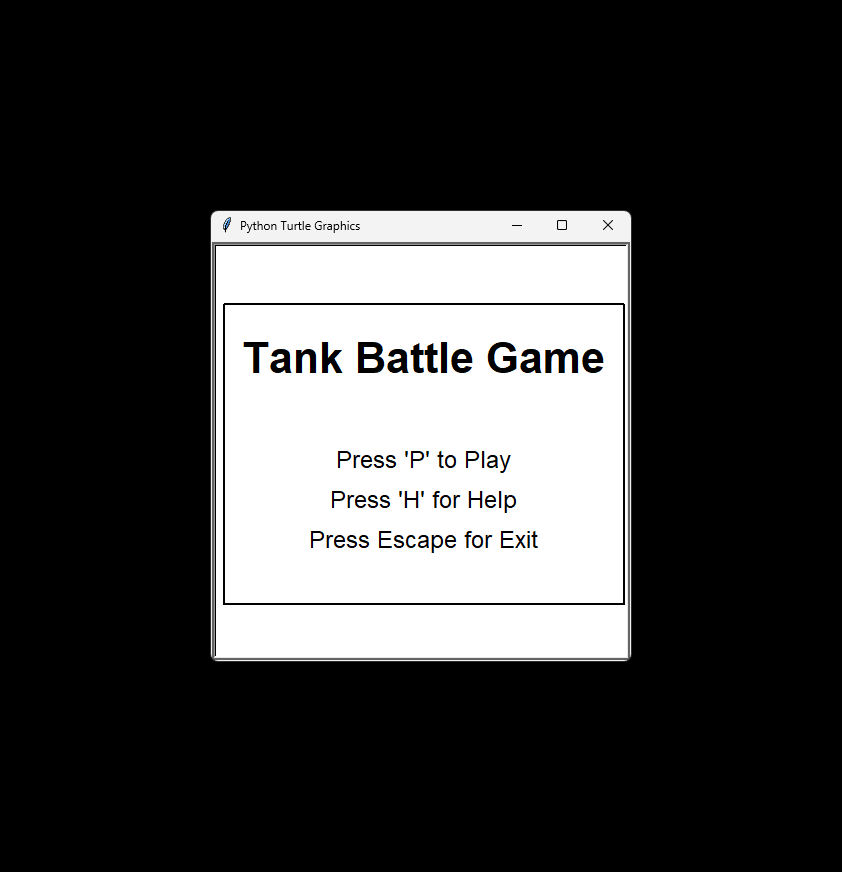
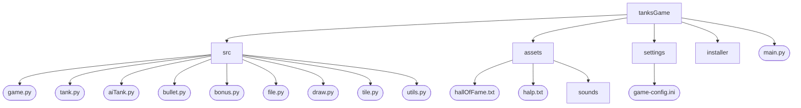
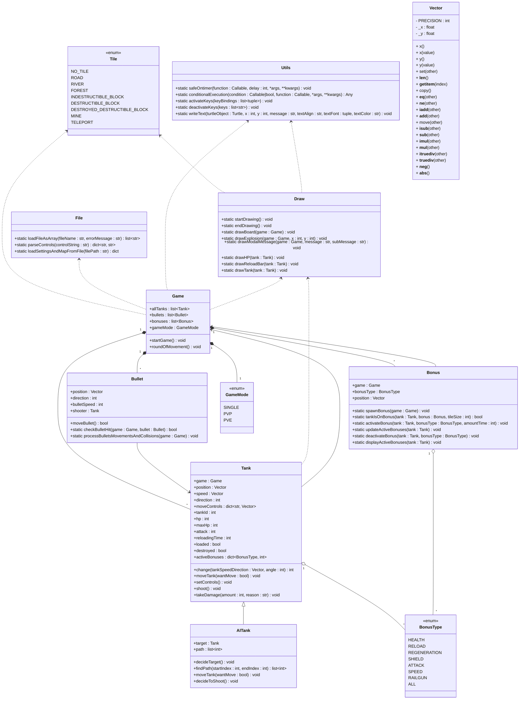
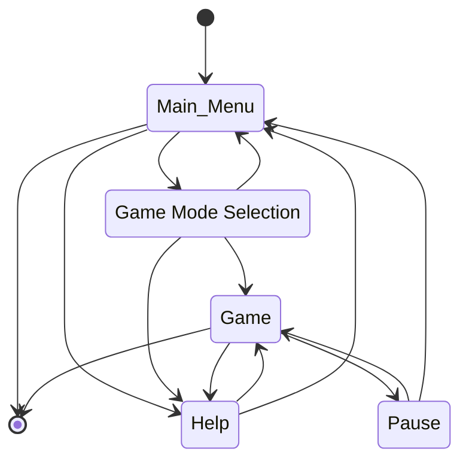

___
**Tank Game Created in Python 3.11**
___

## README Content
1. :video_game: [Game Description](#game-description)
2. :scroll: [Functionality](#functionality)
3. :cd: [Installation via Installer](#installation-via-installer)
4. :dragon: [Installation Guide for Developers](#installation-guide-for-developers)
5. :wrench: [Configuration File Options](#configuration-file-options)
6. :earth_africa: [Map Tile Types](#map-tile-types)
7. :gift: [Bonus Types](#bonus-types)
8. :file_folder: [Project File Structure](#project-file-structure)
9. :godmode: [Classes](#classes)
10. :recycle: [Game States](#game-states)
11. :camera: [Game Screenshots](#game-screenshots)

# Game Description
A tank game where the goal is to destroy all enemy tanks.<br/>
Depending on the selected game mode, the player must destroy all computer-controlled enemy tanks or the enemy tank of another player. 
<h3><details open><summary>Demo game</summary>



</details></h3>

# Functionality
**Tank Game**
1) [x] The game draws the map, tanks, bonuses, and bullets.
2) [x] Tank control. The tank can move, stop, and shoot.
3) [x] Create a custom map in the configuration file.
4) [x] Set game parameters, controls, the number of opponents, and file paths in the configuration file.
5) [x] Computer-controlled tanks.
6) [x] 3 game modes: Single Player, multiplayer PVP, or PVE.
7) [x] Collect and use bonuses.
8) [x] Sounds of shooting and destruction.
9) [x] Hall of fame saving the top 10 player scores.
10) [x] Pause the game, open help, and return to the menu.

# Installation via Installer

1. Download the installer:
   **`TanksBattleGameInstaller.exe`** located in the **`installer`** folder or available in [Releases](../../releases/latest).

2. Run the installer and follow the on-screen instructions.

3. After installation:
   - A game shortcut will be created on the desktop (if this option was selected in the installer).
   - You can also launch the game from the Start menu or directly from the installation folder.

### Uninstalling the Game
You can uninstall the game at any time:
   - Via the **Control Panel** in the **Programs and Features** section.
   - Or from the installation folder by using the **`unins000.exe`** file.

# Installation Guide for Developers
Create a virtual environment:
```sh
python -m venv venv
```

Activate the virtual environment:
```sh
.\venv\Scripts\activate
```
Install all necessary libraries from `requirements.txt`:
```sh
pip install -r .\requirements.txt
```

# Configuration File Options
### map
**tiles** - Set the values of map tiles (from 0 to 8), replacing 1 with a space if it's not the last value in the row.

### settings
**centerGameOnScreen** - Enable centering the game window relative to the entire screen.<br/>
**startGameX** - X-axis position on the screen in pixels where the game should start, if not centered.<br/>
**startGameY** - Y-axis position on the screen in pixels where the game should start, if not centered.<br/>
**rows** - Number of rows on the map.<br/>
**columns** - Number of columns on the map.<br/>
**tileSize** - Tile size, should be a multiple of 20 (e.g., 20, 40, 60).<br/>
**basicHp** - Basic HP of tanks.<br/>
**basicAttack** - Basic attack value of tanks.<br/>
**numberOfRandomMines** - Number of random mines that should appear on the map.<br/>
**timeAfterWhichMinesHide** - Time in seconds after which mines become invisible.<br/>

### controls
Set controls for player tanks.<br/>
Available [key values](https://anzeljg.github.io/rin2/book2/2405/docs/tkinter/key-names.html) used in Python tkinter.<br/>
 - Move up Up: key value (e.g., w).<br/>
 - Move down Down: key value (e.g., s).<br/>
 - Move left Left: key value (e.g., a).<br/>
 - Move right Right: key value (e.g., d).<br/>
 - Shoot Shoot: key value (e.g., Return for Enter).<br/>
 - Stop tank Stop: key value (e.g., Shift_L for left Shift).<br/>

**firstTankControls** - Set keys for controlling player 1's tank.<br/>
**secondTankControls** - Set keys for controlling player 2's tank.<br/>

### filePaths
**helpFilePath** - Path to the help file.<br/>
**hallOfFameStoragePath** - Path to the file storing the top 10 player scores.<br/>

### positions
**firstTankSpawnPosition** - Tile index where the first tank should spawn.<br/>
**secondTankSpawnPosition** - Tile index where the second tank should spawn.<br/>

### enemies
**enemyTanksPositions** - Tile indices where enemy bot tanks should spawn.<br/>

### bonuses
**enableBonuses** - Whether bonuses should appear on the map.<br/>
**uniqueBonuses** - Whether only unique bonuses should appear on the map.<br/>
**bonusSpawningFrequency** - Frequency in seconds at which new bonuses should appear on the map.<br/>
**maxNumberOfBonuses** - Maximum number of bonuses that can be present on the map at the same time.<br/>

### Example configuration file **`tanksConfig.ini`**
```ini
[map]
tiles =
    4,4, ,4,4,4,4,4,4, ,4,4,4,4,4,4, ,4,4,4
    4, , , , , , , , , , , , , , , , , , ,4
    4, ,5,5,5,5,5, , ,7, , , , , , , , , ,4
    4, ,5, , , ,5, , , , , , , , , , , , ,4
    1, ,5, , , ,5, , , , , , , , , , , , ,1
    4, ,5, , , ,5, , ,5, , , , , , , , , ,4
    4, ,5,5,5,5,5, , ,4, , , , , , , , , ,4
    4, , , ,7, , ,5,5,5,5,5, , ,7, , , , ,4
    4, , , , , , , , ,5, , , , , , , , , ,4
    4, , , , , , , , ,5, , , , , , , , , ,4
    4, ,2,2,2,2,2,2, ,5, ,2,2,2,2,2,2,2, ,4
    4, ,2,2,2,2,2,2, , , ,2,2,2,2,2,2,2, ,4
    1, ,3,3,3,3,3,3, , , ,5,5,5,5,5,5,5, ,4
    4, ,3,3,3,3,3,3, ,7, ,5, , , , , ,5, ,4
    4, ,3,3,3,3,3,3, , , ,5, , , , , ,5, ,4
    4, ,3,3,3,3,3,3, , , ,5, , , , , ,5, ,1
    4, ,3,3,3,3,3,3, , , ,5, , , , , ,5, ,4
    4, ,3,3,3,3,3,3, , , ,5,5,5,5,5,5,5, ,4
    1, , , , , , , , , , , , , , , , , , ,4
    4,4, ,4,4,4,4,4,4, ,4,4,4,4,4,4, ,4,4,4

[settings]
startGameX = 540
startGameY = 0
rows = 20
columns = 20
; The preferred size of the tiles to avoid errors is a multiple of 20
tileSize = 40
basicHp = 50
basicAttack = 20
numberOfRandomMines = 0
timeAfterWhichMinesHide = 20

[controls]
firstTankControls = Up:Up, Down:Down, Left:Left, Right:Right, Stop:Shift_L, Shoot:Return
secondTankControls = Up:w, Down:s, Left:a, Right:d, Stop:i, Shoot:u

[filePaths]
helpFilePath = files/help.txt
hallOfFameStoragePath = files/hallOfFame.txt

[positions]
; index of tile where spawn tank
firstTankSpawnPosition = 315
secondTankSpawnPosition = 84

[enemies]
enemyTanksPositions = 21, 38, 361, 378

[bonuses]
enableBonuses = true
uniqueBonuses = true
bonusSpawningFrequency = 5
maxNumberOfBonuses = 5
```

# Map Tile Types

| ID | Map Tile                      | Description                                                                  |
|:--:|-------------------------------|------------------------------------------------------------------------------|
| 0  | **no tile**                   | Treated as an element not part of the map.                                   |
| 1  | **road**                      | Tile where tanks can move with no special effects.                           |
| 2  | **river**                     | Tile where tanks cannot move, but bullets can pass through.                  |
| 3  | **forest**                    | Tile where tanks can move but remain invisible.                              |
| 4  | **indestructible&nbsp;block** | Blocks tanks and bullets, cannot be destroyed.                               |
| 5  | **destructible&nbsp;block**   | Blocks tanks but can be destroyed by shooting.                               |
| 6  | **destroyed&nbsp;block**      | Acts like a road; a destructible block destroyed by a bullet.                |
| 7  | **mine**                      | Acts like a road but damages tanks randomly upon entry.                      |
| 8  | **teleport**                  | Automatically appears on map edges and teleports tanks to the opposite side. |

# Bonus Types

| ID | Bonus                     | Description                                                                                |
|:--:|---------------------------|--------------------------------------------------------------------------------------------|
| 1  | **health**                | Instantly heals the tank by 30 HP, with a maximum limit of 2 * basicHp.                    |
| 2  | **reload**                | Reloads and halves the reload time for 10 seconds, minimum reload time is 0.2 seconds.     |
| 3  | **regeneration**          | Heals 10% of the tank's maximum HP every second for 10 seconds, without exceeding the max. |
| 4  | **shield**                | Makes the tank invulnerable for 4 seconds.                                                 |
| 5  | **increased&nbsp;damage** | Doubles the tank's damage for 5 seconds.                                                   |
| 6  | **speed**                 | Doubles the tank's speed and bullet speed for 10 seconds.                                  |
| 7  | **railgun**               | Fires lasers for 7 seconds, instantly hitting targets.                                     |
| 8  | **all bonuses**           | Activates all bonuses for 5 seconds, including a one-time health boost.                    |

# Project File Structure
<!---cmd: tree /F  --->
```
tanksGame
│   game.spec
│   main.py
│   main.spec
│   requirements.txt
│
├───src
│       aiTank.py
│       bonus.py
│       bullet.py
│       draw.py
│       file.py
│       game.py
│       tank.py
│       tile.py
│       utils.py
│       __init__.py
│
├───assets
│   │   hallOfFame.txt
│   │   help.txt
│   │
│   └───sounds
│           damage.wav
│           explosion.wav
│           game-over.mp3
│           laserShoot.wav
│           railgun.mp3
│           victory.mp3
│
├───settings
│       game-config.ini
└───installer
        setupScript.iss
        TanksBattleGameInstaller.exe
```



# Classes
**Game** - manages the game, changes game states. Initializes the map and tanks. Contains the method <b><code>roundOfMovement</code></b>, which includes the main game loop.<br/>
**Tank** - represents the player's tank, stores its attributes (e.g., health, position) and the logic for movement, shooting, and collisions.<br/>
**AITank** - inherits from Tank, adds AI logic, including target selection, movement pathfinding, shooting decisions, and responses to being blocked.<br/>
**Bullet** - represents a bullet, handles its movement, collisions, and interactions with other objects on the board.<br/>
**Bonus** - represents a bonus, including its appearance, activation, functionality, and display on the board.<br/>
**File** - 'static' class responsible for loading and processing files, including configuration, maps, and control settings.<br/>
**Draw** - 'static' class containing methods for drawing basic shapes and elements such as bonuses.<br/>
**Utils** - 'static' class containing helper methods used in other classes.<br/>
**Vector** - represents a two-dimensional vector, used for handling the position, movement, and transformation of objects in the game.</br>

### Enums
**GameMode** - defines available game modes (Single player, PVP, PVE).<br/>
**Tile** - defines map tile types (road, forest, teleport, mine...).<br/>
**BonusType** - defines available bonus types (health, regeneration, speed, attack...).<br/>



# Game States
1. Main Menu - Options available:
   - Pressing 'P' transitions to Game Mode Selection.
   - Pressing 'H' transitions to Help.
   - Pressing 'Escape' exits the game.
2. Game Mode Selection
   - Pressing '1' starts Single Player.
   - Pressing '2' starts PVP.
   - Pressing '3' starts PVE.
   - Pressing 'H' transitions to Help.
   - Pressing 'Escape' returns to the Main Menu.
3. Game
4. Help
   - Pressing 'H' enters Help.
   - Pressing 'H' again exits Help.
5. Pause
   - Pressing 'P' during gameplay pauses the game.
   - Pressing 'P' again resumes the game.
6. Hall of Fame
   - Automatically activates 2 seconds after the game ends in Single Player mode.



# Game Screenshots

<h3><details open><summary>Main menu</summary></details></h3>
<h3><details open><summary>Selection of game mode</summary></details></h3>
<h3><details open><summary>Example game</summary></details></h3>
<h3><details open><summary>Example end game</summary></details></h3>
<h3><details open><summary>Hall of fame</summary></details></h3>
<h3><details open><summary>Help</summary></details></h3>
<h3><details open><summary>Pause</summary></details></h3>
