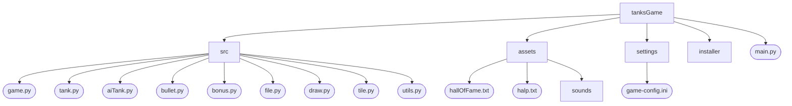
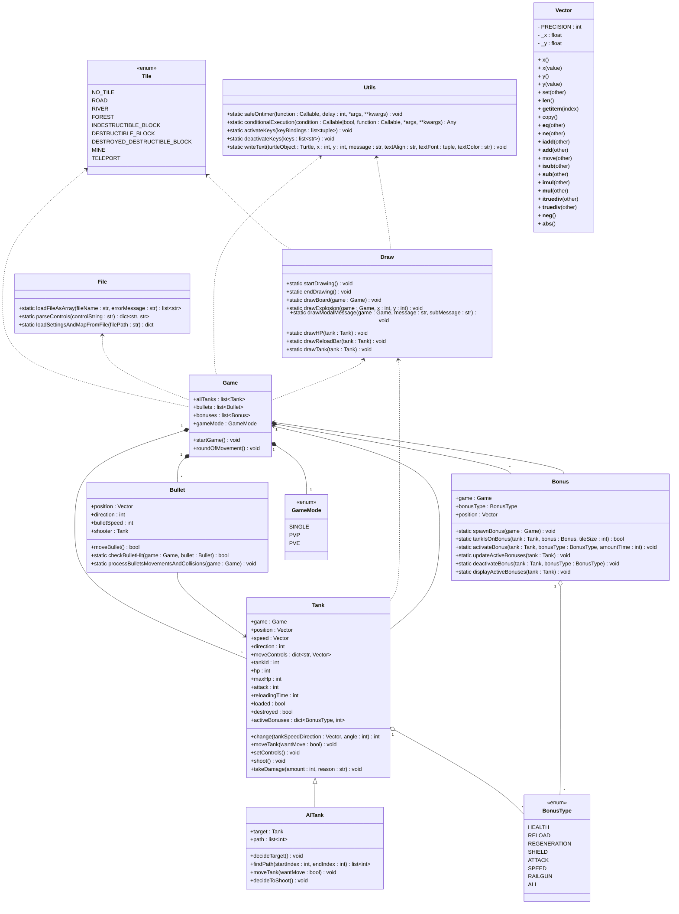
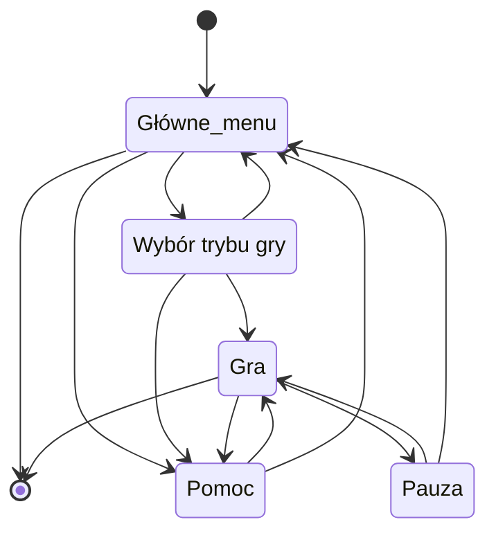

> [!Tip]  
> ## [English version of the README is available in README.en.md](README.en.md)
___
**Gra w czołgi stworzona w python 3.11**
___

## Zawartość REDME
1. :video_game: [Opis gry](#opis-gry)
2. :scroll: [Funkcjonalność](#funkcjonalność)
3. :cd: [Instalacja za pomocą instalatora](#instalacja-za-pomocą-instalatora)
4. :dragon: [Instrukcja instalacji dla programistów](#instrukcja-instalacji-dla-programistów)
5. :wrench: [Opcje pliku konfiguracyjnego](#opcje-pliku-konfiguracyjnego)
6. :world_map: [Rodzaje pól mapy](#rodzaje-pól-mapy)
7. :gift: [Rodzaje bonusów](#rodzaje-bonusów)
8. :gem: [Punktacja](#punktacja)
9. :file_folder: [Struktura plików projektu](#struktura-plików-projektu)
10. :godmode: [Klasy](#klasy)
11. :recycle: [Stany gry](#stany-gry)
12. :camera: [Screenshoty z gry](#screenshoty-z-gry)
13. :hammer_and_wrench: [Tworzenie instalatora do gry](#tworzenie-instalatora-do-gry)

# Opis gry
Gra w czołgi, w której celem jest zniszczenie wszystkich wrogich czołgów.</br>
W zależności od wybranego trybu gry, gracz musi zniszczyć wszystkie wrogie czołgi komputera lub wrogi czołg innego gracza.
<h3><details open><summary>Demo game</summary>


</details></h3>

# Funkcjonalność
**Gra w czołgi**
1) [x] Gra rysuje mapę, czołgi, bonusy i pociski.
2) [x] Sterowanie czołgiem. Czołg może jeździć, zatrzymywać się i strzelać.
3) [x] Tworzenie własnej mapy w pliku konfiguracyjnym.
4) [x] Ustawianie parametrów gry, sterowania, liczby przeciwników oraz ścieżek do plików w pliku konfiguracyjnym.
5) [x] Czołgi sterowane przez komputer.
6) [x] 3 tryby gry Single Player oraz multiplayer PVP lub PVE.
7) [x] Zdobywanie i używanie bonusów.
8) [x] Dźwięki strzałów i zniszczeń.
9) [x] Hala sławy zapisująca 10 najlepszych wyników graczy.
10) [x] Pauzowanie gry, otwieranie helpa oraz powrót do menu.

# Instalacja za pomocą instalatora

1. Pobierz plik instalatora:
   **`TanksBattleGameInstaller.exe`** znajdujący się w folderze **`installer`** lub dostępny w [Releases](../../releases/latest).

2. Uruchom instalator i postępuj zgodnie z wyświetlanymi instrukcjami.

3. Po zakończeniu instalacji:
   - Na pulpicie zostanie utworzona ikona gry (jeśli wybrano tę opcję w instalatorze).
   - Możesz uruchomić grę również z menu Start lub bezpośrednio z folderu instalacyjnego.

### Odinstalowanie gry
Grę możesz odinstalować w dowolnym momencie:
   - Za pomocą **Panelu sterowania** w sekcji **Programy i funkcje**.
   - Lub z folderu instalacyjnego, używając pliku **`unins000.exe`**.

# Instrukcja instalacji dla programistów
Tworzymy wirtualne środowisko
```sh
python -m venv venv
```

Aktywujemy wirtualne środowisko
```sh
.\venv\Scripts\activate
```
Instalujemy wszystkie potrzebne biblioteki z pliku `requirements.txt`
```sh
pip install -r .\requirements.txt
```

# Opcje pliku konfiguracyjnego
### map
**tiles** - ustawienie wartości pól mapy (od 0 do 8), gdzie można zastąpić 1 spacją, jeśli nie jest to ostatnia wartość w wierszu

### settings
**centerGameOnScreen** - włączenie wyśrodkowania okna gry względem całego ekranu</br>
**startGameX** - pozycja w osi X na ekranie gdzie ma rozpocząć grę podawana w pixelach, jeśli nie wyśrodkowano okna gry</br>
**startGameY** - pozycja w osi Y na ekranie gdzie ma rozpocząć grę podawana w pixelach, jeśli nie wyśrodkowano okna gry</br>
**rows** - liczba wierszy na mapie</br>
**columns** - liczba kolumn na mapie</br>
**tileSize** - rozmiar pola, powinien być wielokrotnością liczby 20 np. 20, 40, 60</br>
**basicHp** - podstawowe hp czołgów</br>
**basicAttack** - podstawowy atak czołgów</br>
**numberOfRandomMines** - liczba losowych min, które mają się pojawić na mapie</br>
**timeAfterWhichMinesHide** - czas liczony w sekundach po którym miny przestaną być widoczne</br>

### controls
Ustawienie sterowania czołgów gracza.</br>
Dostępne [wartości klawiszy](https://anzeljg.github.io/rin2/book2/2405/docs/tkinter/key-names.html) używanych w python tkinter</br>
 - Poruszanie się do góry Up: wartość klawisza np. w</br>
 - Poruszanie się do dołu Down: wartość klawisza np. s</br>
 - Poruszanie się w lewo Left: wartość klawisza np. a</br>
 - Poruszanie się w prawo Right: wartość klawisza np. d</br>
 - Strzelanie Shoot: wartość klawisza np. Return (odpowiednik Enter-a)</br>
 - Zatrzymywanie czołgu Stop: wartość klawisza np. Control_R (odpowiednik prawego controla)</br>

**firstTankControls** - ustawienie klawiszy sterujących czołgiem 1 gracza</br>
**secondTankControls** - ustawienie klawiszy sterujących czołgiem 2 gracza</br>

### filePaths
**helpFilePath** - ścieżka do pliku z pomocą</br>
**hallOfFameStoragePath** - ścieżka do pliku przechowującego 10 najlepszych wyników graczy</br>

### positions
**firstTankSpawnPosition** - indeks pola gdzie ma pojawić się 1 czołg na starcie</br>
**secondTankSpawnPosition** - indeks pola gdzie ma pojawić się 2 czołg na starcie</br>

### enemies
**enemyTanksPositions** - indeksy pól gdzie mają pojawiać się czołgi wrogich botów</br>

### bonuses
**enableBonuses** - czy na planszy mają pojawiać się bonusy</br>
**uniqueBonuses** - czy na planszy mają być tylko unikalne bonusy</br>
**bonusSpawningFrequency** - czas co ile sekund ma pojawiać się nowy bonus na planszy</br>
**maxNumberOfBonuses** - maksymalna liczba bonusów jaka jest w tym samym czasie może być na planszy</br>

### Przykład pliku konfiguracyjnego **`tanksConfig.ini`**
```ini
[map]
tiles =
    4,4, ,4,4,4,4,4,4, ,4,4,4,4,4,4, ,4,4,4
    4, , , , , , , , , , , , , , , , , , ,4
    4, ,5,5,5,5,5, , ,7, , , , , , , , , ,4
    4, ,5, , , ,5, , , , , , , , , , , , ,4
    1, ,5, , , ,5, , , , , , , , , , , , ,1
    4, ,5, , , ,5, , ,5, , , , , , , , , ,4
    4, ,5,5,5,5,5, , ,4, , , , , , , , , ,4
    4, , , ,7, , ,5,5,5,5,5, , ,7, , , , ,4
    4, , , , , , , , ,5, , , , , , , , , ,4
    4, , , , , , , , ,5, , , , , , , , , ,4
    4, ,2,2,2,2,2,2, ,5, ,2,2,2,2,2,2,2, ,4
    4, ,2,2,2,2,2,2, , , ,2,2,2,2,2,2,2, ,4
    1, ,3,3,3,3,3,3, , , ,5,5,5,5,5,5,5, ,4
    4, ,3,3,3,3,3,3, ,7, ,5, , , , , ,5, ,4
    4, ,3,3,3,3,3,3, , , ,5, , , , , ,5, ,4
    4, ,3,3,3,3,3,3, , , ,5, , , , , ,5, ,1
    4, ,3,3,3,3,3,3, , , ,5, , , , , ,5, ,4
    4, ,3,3,3,3,3,3, , , ,5,5,5,5,5,5,5, ,4
    1, , , , , , , , , , , , , , , , , , ,4
    4,4, ,4,4,4,4,4,4, ,4,4,4,4,4,4, ,4,4,4

[settings]
startGameX = 540
startGameY = 0
rows = 20
columns = 20
; The preferred size of the tiles to avoid errors is a multiple of 20
tileSize = 40
basicHp = 50
basicAttack = 20
numberOfRandomMines = 0
timeAfterWhichMinesHide = 20

[controls]
firstTankControls = Up:Up, Down:Down, Left:Left, Right:Right, Stop:Control_R, Shoot:Return
secondTankControls = Up:w, Down:s, Left:a, Right:d, Stop:i, Shoot:u

[filePaths]
helpFilePath = files/help.txt
hallOfFameStoragePath = files/hallOfFame.txt

[positions]
; index of tile where spawn tank
firstTankSpawnPosition = 315
secondTankSpawnPosition = 84

[enemies]
enemyTanksPositions = 21, 38, 361, 378

[bonuses]
enableBonuses = true
uniqueBonuses = true
bonusSpawningFrequency = 5
maxNumberOfBonuses = 5
```

# Rodzaje pól mapy

| ID | Pole mapy                        | Opis działania pola mapy                                                                                                                                                     |
|:--:|----------------------------------|------------------------------------------------------------------------------------------------------------------------------------------------------------------------------|
| 0  | **brak pola**                    | Traktowane jako element nie należący do mapy.                                                                                                                                |
| 1  | **droga**                        | Pole po którym mogą jeździć czołgi i nie ma żadnych specjalnych efektów.                                                                                                     |
| 2  | **rzeka**                        | Pole po którym nie mogą jeździć czołgi, ale pociski mogą przelatywać przez nie.                                                                                              |
| 3  | **las**                          | Pole po którym mogą jeździć czołgi, ale są wtedy niewidoczne.                                                                                                                |
| 4  | **niezniszczalny&nbsp;blok**     | Blokuje czołgi i pociski, nie można go zniszczyć.                                                                                                                            |
| 5  | **niszczący&nbsp;się&nbsp;blok** | Blokuje czołgi, ale można go zniszczyć strzelając do niego.                                                                                                                  |
| 6  | **zniszczony&nbsp;blok**         | Działa jak droga, jest to niszczący się blok który został zniszczony przez pocisk.                                                                                           |
| 7  | **mina**                         | Działa jak droga, ale przy wjeździe czołg otrzymuje losową liczbę obrażeń z zakresu od połowy do dwukrotności basicAttack.                                                   |
| 8  | **teleport**                     | Automatycznie tworzy się na obrzeżach mapy dla pól, które nie są niezniszczalnym blokiem. Teleportuje czołg na przeciwną stronę mapy. Zabiera 10% hp, ale nie zabija czołgu. |

# Rodzaje bonusów

| ID | Bonus                         | Opis działania bonusu                                                                                                       |
|:--:|-------------------------------|-----------------------------------------------------------------------------------------------------------------------------|
| 1  | **zdrowie**                   | Natychmiastowo leczy czołg o 30 hp, maksymalny limit hp dla czołgu to 2 * basicHp.                                          |
| 2  | **przeładowanie**             | Przeładowuje i przez 10 sekund skraca czas przeładowania dwukrotnie, minimalny czas przeładowania to 0.2 sekundy.           |
| 3  | **regeneracja**               | Przez 10 sekund co sekundę leczy czołg o 10% jego maksymalnego hp, ale nie przekracza limitu maksymalnego hp jaki ma czołg. |
| 4  | **tarcza**                    | Przez 4 sekundy czołg jest niewrażliwy na wszelkie obrażenia.                                                               |
| 5  | **zwiększone&nbsp;obrażenia** | Przez 5 sekund czołg zadaje 2 razy więcej obrażeń.                                                                          |
| 6  | **prędkość**                  | Przez 10 sekund czołg porusza się 2 razy szybciej, pociski wystrzelone przez czołg też lecą 2 razy szybciej.                |
| 7  | **railgun**                   | Przez 7 sekund czołg strzela laserem, laser natychmiast dociera do celu i zadaje obrażenia.                                 |
| 8  | **wszystkie bonusy**          | Przez 5 sekund czołg otrzymuje wszystkie pozostałe bonusy, w tym jednorazowo zdrowie.                                       |

# Punktacja

### W trybie single player gracz otrzymuje punkty naliczane według wzoru:</br>
**punkty** = **`m * (z + u + h + t)`**</br>
**`m`** - **mnożnik punktowy**</br>
**`z`** - **punkty za zniszczone czołgi**</br>
**`u`** - **punkty za uszkodzone czołgi**</br>
**`h`** - **punkty za pozostałe życie**</br>
**`t`** - **punkty za pozostały czas**</br>

**`m`** = **liczba_wrogich_czołgów * (2 jeśli wygrana lub 1 jeśli przegrana)**</br>
**`z`** = **400 * podstawowe_życie / podstawowy_atak * liczba zniszczonych czołgów**</br>
**`u`** = **200 / podstawowy_atak * (suma zabranego życia nie znisczonym czołgom)**</br>
**`h`** = **500 / podstawowe_życie * pozostałe_życie**</br>
**`t`** = **punkty_z_1_progu_czasowego + punkty_z_2_progu_czasowego + punkty_z_3_progu_czasowego + punkty_z_4_progu_czasowego**</br>

### Progi czasowe:
| Próg | Mnożnik w progu | Koniec progu czasowego               |
|:----:|:---------------:|--------------------------------------|
|  1   |       25        | 5 sekund * liczba_wrogich_czołgów    |
|  2   |       10        | 7,5 sekundy * liczba_wrogich_czołgów |
|  3   |        5        | 10 sekund * liczba_wrogich_czołgów   |
|  4   |        1        | 15 sekund * liczba_wrogich_czołgów   |

#### Punktacja za progi czasowe jest naliczana co 0.1 sekundy</br>
np. jeśli był 1 wrogi czołg, a ukończyliśmy grę w 4.2 sekundy to otrzymamy:</br>
<b>t = 25 * (10 * (5-4.2)s) + 10 * (10 * 2.5s) + 5 * (10 * 2.5s) + (10 * 5s) = 200 + 250 + 125 + 50 = 625</b></br>

# Struktura plików projektu
<!--- W cmd: tree /F  --->
```
tanksGame
│   game.spec
│   main.py
│   main.spec
│   requirements.txt
│
├───src
│       aiTank.py
│       bonus.py
│       bullet.py
│       draw.py
│       file.py
│       game.py
│       tank.py
│       tile.py
│       utils.py
│       __init__.py
│
├───assets
│   │   hallOfFame.txt
│   │   help.txt
│   │
│   └───sounds
│           damage.wav
│           explosion.wav
│           game-over.mp3
│           laserShoot.wav
│           railgun.mp3
│           victory.mp3
│
├───settings
│       game-config.ini
└───installer
        setupScript.iss
        TanksBattleGameInstaller.exe
```



# Klasy
**Game** - zarządza grą, zmienia stany gry. Inicjalizuje mapę oraz czołgi. W niej znajduje się metoda <b><code>roundOfMovement</code></b> zawierająca główną pętle gry.</br>
**Tank** - reprezentuje czołg gracza, przechowuje jego atrybuty (np. zdrowie, pozycję) i logikę ruchu, strzelania oraz kolizji.</br>
**AITank** - dziedziczy po Tank, dodaje logikę sztucznej inteligencji, w tym wybór celu, ścieżkę poruszania się, decyzje o strzelaniu oraz reakcje na zablokowanie.</br>
**Bullet** - reprezentuje pocisk, odpowiada za jego ruch, kolizje i interakcje z innymi obiektami na planszy.</br>
**Bonus** - reprezentuje bonus, w tym jego pojawienie się, aktywację, działanie i wyświetlanie na planszy.</br>
**File** - 'statyczna' klasa, odpowiada za ładowanie i przetwarzanie plików, w tym konfiguracji, map i ustawień sterowania.</br>
**Draw** - 'statyczna' klasa zawiera metody rysowania podstawowych figur oraz elementów takich jak np. bonusy.</br>
**Utils** - 'statyczna' klasa zawiera pomocnicze metody wykorzystywane w innych klasach.</br>
**Vector** - reprezentuje dwuwymiarowy wektor, wykorzystywany do obsługi pozycji, ruchu oraz transformacji obiektów w grze.</br>

### Enumy
**GameMode** - definiuje dostępne tryby gry. (Single player, PVP, PVE)</br>
**Tile** - definiuje typy pól na planszy. (droga, las, teleport, mina...)</br>
**BonusType** - definiuje dostępne typy bonusów. (zdrowie, regeneracja, szybkość, atak...)</br>



# Stany gry
1. Głowne menu - posiada opcje do wyboru:
   - Kliknięcie 'P' powoduje przejście do Wyboru trybu gry
   - Kliknięcie 'H' powoduje przejście do pomocy
   - Kliknięcie 'Escape' powoduje wyjście z gry
2. Wybór trybu gry
   - Kliknięcie '1' powoduje rozpoczęcie gry Single Player
   - Kliknięcie '2' powoduje rozpoczęcie gry PVP
   - Kliknięcie '3' powoduje rozpoczęcie gry PVE
   - Kliknięcie 'H' powoduje przejście do pomocy
   - Kliknięcie 'Escape' powoduje powrót do głównego menu
3. Gra
4. Pomoc
   - Kliknięcie 'H' wchodzi do pomocy
   - Ponowne kliknięcie 'H' wychodzi z pomocy
5. Pauza
   - Kliknięcie 'P' w trakcie gry pauzuje grę
   - Ponowne kliknięcie 'P' wznawia grę
6. Sala chwały
   - Automatycznie uruchamia się 2 sekundy po zakończeniu się gry w trybie Single Player



# Screenshoty z gry

<h3><details hide><summary>Main menu</summary></details></h3>
<h3><details hide><summary>Selection of game mode</summary></details></h3>
<h3><details hide><summary>Example game</summary></details></h3>
<h3><details hide><summary>Example end game</summary></details></h3>
<h3><details hide><summary>Hall of fame</summary></details></h3>
<h3><details hide><summary>Help</summary></details></h3>
<h3><details hide><summary>Pause</summary></details></h3>

# Tworzenie instalatora do gry

1. Przejdź do katalogu z `main.py`:
    ```bash
    cd /ścieżka/do/katalogu
    ```
2. W terminalu wykonaj poniższe polecenie, aby stworzyć plik wykonywalny:
    ```bash
    pyinstaller --onefile --noconsole --add-data "assets:assets" --add-data "settings:settings" --distpath=. main.py
    ```
3. Uruchom **Inno Setup Compiler** i skompiluj plik `setupScript.iss`:
    - Otwórz Inno Setup Compiler.
    - Wybierz plik `setupScript.iss`.
    - Kliknij **Compile** (lub użyj skrótu `F9`), aby stworzyć instalator.
