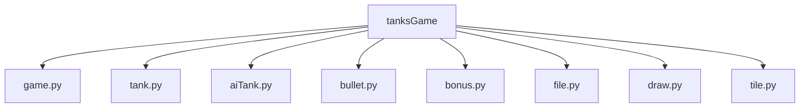
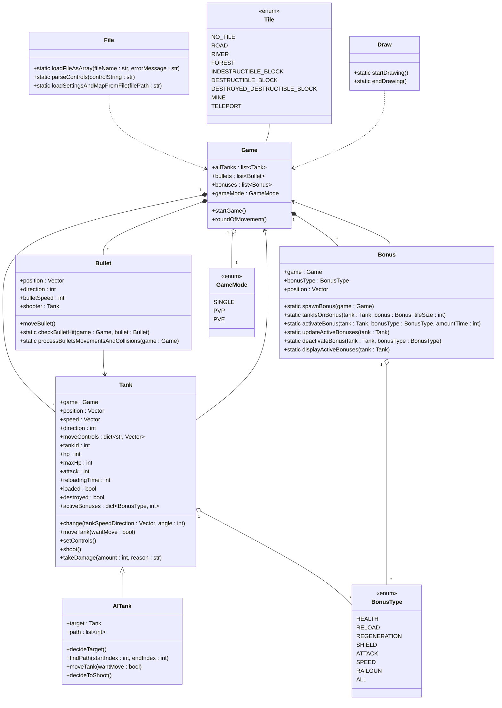
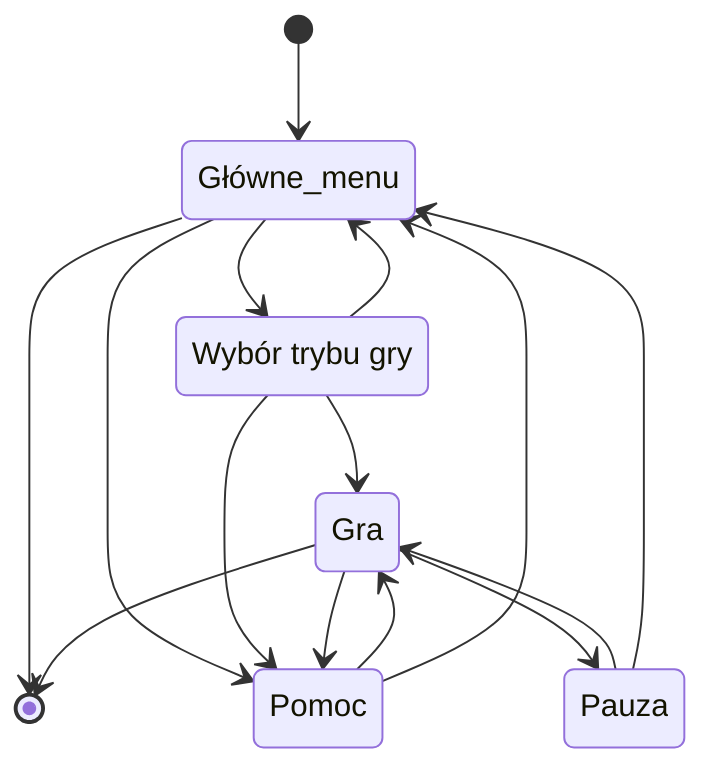

___
**Gra w czołgi stworzona w python 3.11**
___

## Zawartość REDME
1. :video_game: [Opis gry](#opis-gry)
2. :scroll: [Funkcjonalność](#funkcjonalność)
3. :dragon: [Instrukcja instalacji](#instrukcja-instalacji)
4. :wrench: [Opcje pliku konfiguracyjnego](#opcje-pliku-konfiguracyjnego)
5. :earth_africa: [Rodzaje mapy](#rodzaje-mapy)
6. :gift: [Rodzaje bonusów](#rodzaje-bonusów)
7. :file_folder: [Struktura plików projektu](#struktura-plików-projektu)
8. :godmode: [Klasy](#klasy)
9. :recycle: [Stany gry](#stany-gry)

# Opis gry
Gra w czołgi, w której celem jest zniszczenie wszystkich wrogich czołgów.</br>
W zależności od wybranego trybu gry, gracz musi zniszczyć wszystkie wrogie czołgi komputera lub wrogi czołg innego gracza. 

# Funkcjonalność
**Gra w czołgi**
1) [x] Gra rysuje mapę, czołgi, bonusy i pociski.
2) [x] Sterowanie czołgiem. Czołg może jeździć, zatrzymywać się i strzelać.
3) [x] Tworzenie własnej mapy w pliku konfiguracyjnym.
4) [x] Ustawianie parametrów gry, sterowania, liczby przeciwników oraz ścieżek do plików w pliku konfiguracyjnym.
5) [x] Czołgi sterowane przez komputer.
6) [x] 3 tryby gry Single Player oraz multiplayer PVP lub PVE.
7) [x] Zdobywanie i używanie bonusów.
8) [x] Dźwięki strzałów i zniszczeń.
9) [x] Hala sławy zapisująca 10 najlepszych wyników graczy.
10) [x] Pauzowanie gry, otwieranie helpa oraz powrót do menu.

# Instrukcja instalacji
Przechodzimy w konsoli do folderu **`tanksGame`**

Tworzymy wirtualne środowisko
```sh
python -m venv venv
```

Aktywujemy wirtualne środowisko
```sh
.\venv\Scripts\activate
```
Instalujemy wszystkie potrzebne biblioteki z pliku `requirements.txt`
```sh
pip install -r .\files\requirements.txt
```

# Opcje pliku konfiguracyjnego
### map
**tiles** - ustawienie wartości pól mapy (od 0 do 8), gdzie można zastąpić 1 spacją, jeśli nie jest to ostatnia wartość w wierszu

### settings
**startGameX** - pozycja w osi X na ekranie gdzie ma rozpocząć grę podawana w pixelach</br>
**startGameY** - pozycja w osi Y na ekranie gdzie ma rozpocząć grę podawana w pixelach</br>
**rows** - liczba wierszy na mapie</br>
**columns** - liczba kolumn na mapie</br>
**tileSize** - rozmiar pola, powinien być wielokrotnością liczby 20 np. 20, 40, 60</br>
**basicHp** - podstawowe hp czołgów</br>
**basicAttack** - podstawowy atak czołgów</br>
**numberOfRandomMines** - liczba losowych min, które mają się pojawić na mapie</br>
**timeAfterWhichMinesHide** - czas liczony w sekundach po którym miny przestaną być widoczne</br>

### controls
Ustawienie sterowania czołgów gracza.</br>
Dostępne [wartości klawiszy](https://anzeljg.github.io/rin2/book2/2405/docs/tkinter/key-names.html) używanych w python tkinter</br>
 - Poruszanie się do góry Up: wartość klawisza np. w</br>
 - Poruszanie się do dołu Down: wartość klawisza np. s</br>
 - Poruszanie się w lewo Left: wartość klawisza np. a</br>
 - Poruszanie się w prawo Right: wartość klawisza np. d</br>
 - Strzelanie Shoot: wartość klawisza np. Return (odpowiednik Enter-a)</br>
 - Zatrzymywanie czołgu Stop: wartość klawisza np. Shift_L (odpowiednik lewego shifta)</br>

**firstTankControls** - ustawienie klawiszy sterujących czołgiem 1 gracza</br>
**secondTankControls** - ustawienie klawiszy sterujących czołgiem 2 gracza</br>

### filePaths
**helpFilePath** - ścieżka do pliku z pomocą</br>
**hallOfFameStoragePath** - ścieżka do pliku przechowującego 10 najlepszych wyników graczy</br>

### positions
**firstTankSpawnPosition** - indeks pola gdzie ma pojawić się 1 czołg na starcie</br>
**secondTankSpawnPosition** - indeks pola gdzie ma pojawić się 2 czołg na starcie</br>

### enemies
**enemyTanksPositions** - indeksy pól gdzie mają pojawiać się czołgi wrogich botów</br>

### bonuses
**enableBonuses** - czy na planszy mają pojawiać się bonusy</br>
**uniqueBonuses** - czy na planszy mają być tylko unikalne bonusy</br>
**bonusSpawningFrequency** - czas co ile sekund ma pojawiać się nowy bonus na planszy</br>
**maxNumberOfBonuses** - maksymalna liczba bonusów jaka jest w tym samym czasie może być na planszy</br>

#### Przykład pliku konfiguracyjnego **`tanksConfig.ini`**
```ini
[map]
tiles =
    4,4, ,4,4,4,4,4,4, ,4,4,4,4,4,4, ,4,4,4
    4, , , , , , , , , , , , , , , , , , ,4
    4, ,5,5,5,5,5, , ,7, , , , , , , , , ,4
    4, ,5, , , ,5, , , , , , , , , , , , ,4
    1, ,5, , , ,5, , , , , , , , , , , , ,1
    4, ,5, , , ,5, , ,5, , , , , , , , , ,4
    4, ,5,5,5,5,5, , ,4, , , , , , , , , ,4
    4, , , ,7, , ,5,5,5,5,5, , ,7, , , , ,4
    4, , , , , , , , ,5, , , , , , , , , ,4
    4, , , , , , , , ,5, , , , , , , , , ,4
    4, ,2,2,2,2,2,2, ,5, ,2,2,2,2,2,2,2, ,4
    4, ,2,2,2,2,2,2, , , ,2,2,2,2,2,2,2, ,4
    1, ,3,3,3,3,3,3, , , ,5,5,5,5,5,5,5, ,4
    4, ,3,3,3,3,3,3, ,7, ,5, , , , , ,5, ,4
    4, ,3,3,3,3,3,3, , , ,5, , , , , ,5, ,4
    4, ,3,3,3,3,3,3, , , ,5, , , , , ,5, ,1
    4, ,3,3,3,3,3,3, , , ,5, , , , , ,5, ,4
    4, ,3,3,3,3,3,3, , , ,5,5,5,5,5,5,5, ,4
    1, , , , , , , , , , , , , , , , , , ,4
    4,4, ,4,4,4,4,4,4, ,4,4,4,4,4,4, ,4,4,4

[settings]
startGameX = 540
startGameY = 0
rows = 20
columns = 20
; The preferred size of the tiles to avoid errors is a multiple of 20
tileSize = 40
basicHp = 50
basicAttack = 20
numberOfRandomMines = 0
timeAfterWhichMinesHide = 20

[controls]
firstTankControls = Up:8, Down:2, Left:4, Right:6, Stop:Shift_L, Shoot:Return
secondTankControls = Up:w, Down:s, Left:a, Right:d, Stop:i, Shoot:u

[filePaths]
helpFilePath = files/help.txt
hallOfFameStoragePath = files/hallOfFame.txt

[positions]
; index of tile where spawn tank
firstTankSpawnPosition = 315
secondTankSpawnPosition = 84

[enemies]
enemyTanksPositions = 21, 38, 361, 378

[bonuses]
enableBonuses = true
uniqueBonuses = true
bonusSpawningFrequency = 5
maxNumberOfBonuses = 5
```

# Rodzaje mapy
0) **brak pola** - traktowane jako element nie należący do mapy</br>
1) **droga** - pole po którym mogą jeździć czołgi i nie ma żadnych specjalnych efektów</br>
2) **rzeka** - pole po którym nie mogą jeździć czołgi, ale pociski mogą przelatywać przez nie</br>
3) **las** - pole po którym mogą jeździć czołgi, ale są nie widoczne wtedy</br>
4) **nieznisczalny blok** - blokuje czołgi i pociski, nie można go znisczyć</br>
5) **nisczączy się blok** - blokuje czołgi, ale można go znisczyć strzelając do niego</br>
6) **znisczony blok** - działa jak droga, jest to niszczący się blok który został znisczony przez pocisk</br>
7) **mina** - działa jak droga, ale przy wjeździe czołg otrzymuje losową liczbe obrażeń z zakresu od 0.5-2 * basicAttack</br>
8) **teleport** - automatycznie tworzy się na obrzeżach mapy dla pól, które nie są niezniszczalnym blokiem, teleportuje czołg na przeciwną stronę mapy</br>

# Rodzaje bonusów
1) **zdrowie** - natychmiastwo leczy czołg o 30 hp, maksymalny limit hp dla czołgu to 2*basicHp</br>
2) **przeładowanie** - przeładowywuje i przez 10 sekund skraca czas przeładowania dwukrotnie, minimalny czas przeładowania to 0.2 sekundy</br>
3) **regeneracja** - przez 10 sekund co sekundę leczy czołg o 10% jego maksymalnego hp, ale nie przekracza limitu maksymalnego hp jaki ma czołg</br>
4) **tarcza** - przez 4 sekundy czołg jest niewrażliwy na wszelkie obrażenia</br>
5) **zwiększone obrażenia** - przez 5 sekund czołg zadaje 2 razy więcej obrażeń</br>
6) **prędkość** - przez 10 sekund czołg porusza się 2 razy szybciej, pociski wystrzelone przez czołg też lecą 2 razy szybciej</br>
7) **railgun** - przez 7 sekund czołg strzela laserem, natymiachstwo laser dociera do celu</br>
8) **wszystkie bonusy** - przez 5 sekund czołg otrzymuje wszystkie pozostałe bonusy w tym zdrowie 1 raz</br>

# Struktura plików projektu
<!--- W cmd: tree /F  --->
```
tanksGame.
│   aiTank.py
│   bonus.py
│   bullet.py
│   draw.py
│   file.py
│   game.py
│   tank.py
│   tile.py
│   __init__.py
│
└───files
    │   hallOfFame.txt
    │   help.txt
    │   requirements.txt
    │   tanksConfig.ini
    │
    └───sounds
            damage.wav
            explosion.wav
            game-over.mp3
            laserShoot.wav
            railgun.mp3
            victory.mp3
```



# Klasy
**Game** - zarządza grą, zmienia stany gry. Inicjalizuje mapę oraz czołgi. W niej znajduje się metoda <b><code>roundOfMovement</code></b> zawierająca główną pętle gry.</br>
**Tank** - reprezentuje czołg gracza, przechowuje jego atrybuty (np. zdrowie, pozycję) i logikę ruchu, strzelania oraz kolizji.</br>
**AITank** - dziedziczy po Tank, dodaje logikę sztucznej inteligencji, w tym wybór celu, ścieżkę poruszania się, decyzje o strzelaniu oraz reakcje na zablokowanie.</br>
**Bullet** - reprezentuje pocisk, odpowiada za jego ruch, kolizje i interakcje z innymi obiektami na planszy.</br>
**Bonus** - reprezentuje bonus, w tym jego pojawienie się, aktywację, działanie i wyświetlanie na planszy.</br>
**File** - odpowiada za ładowanie i przetwarzanie plików, w tym konfiguracji, map i ustawień sterowania.</br>
**Draw** - zawiera metody rysowania podstawowych figur oraz elementów takich jak np. bonusy.</br>

### Enumy
**GameMode** - definiuje dostępne tryby gry. (Single player, PVP, PVE)</br>
**Tile** - definiuje typy pól na planszy. (droga, las, teleport, mina...)</br>
**BonusType** - definiuje dostępne typy bonusów. (zdrowie, regeneracja, szybkość, atak...)</br>



# Stany gry
1. Głowne menu - posiada opcje do wyboru:
   - Kliknięcie 'P' powoduje przejście do Wyboru trybu gry
   - Kliknięcie 'H' powoduje przejście do pomocy
   - Kliknięcie 'Escape' powoduje wyjście z gry
2. Wybór trybu gry
   - Kliknięcie '1' powoduje rozpoczęcie gry Single Player
   - Kliknięcie '2' powoduje rozpoczęcie gry PVP
   - Kliknięcie '3' powoduje rozpoczęcie gry PVE
   - Kliknięcie 'H' powoduje przejście do pomocy
   - Kliknięcie 'Escape' powoduje powrót do głównego menu
3. Gra
4. Pomoc
   - Kliknięcie 'H' wchodzi do pomocy
   - Ponowne kliknięcie 'H' wychodzi z pomocy
5. Pauza
   - Kliknięcie 'P' w trakcie gry pauzuje grę
   - Ponowne kliknięcie 'P' wznawia grę
6. Sala chwały
   - Automatycznie uruchamia się 2 sekundy po zakończeniu się gry w trybie Single Player


